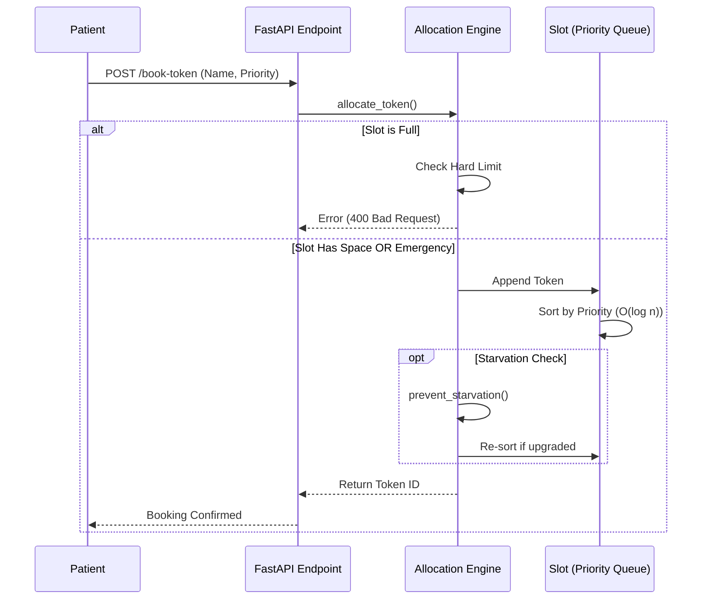

# 🏥 OPD Token Allocation Engine


A high-performance backend service designed to manage hospital Outpatient Department (OPD) token allocation. The system features **elastic capacity management**, **weighted priority queuing**, and an intelligent **starvation prevention algorithm** to handle real-world variability like emergency insertions and delays.

---

## 🚀 Key Features

* **⚡ Elastic Capacity:** Automatically expands hard limits for `EMERGENCY` patients, ensuring critical cases are never rejected.
* **⚖️ Weighted Priority Queue:** Patients are sorted in real-time ($O(N \log N)$) based on triage category:
    1.  **Emergency** (Highest Priority - 0)
    2.  **Paid Priority** (1)
    3.  **Follow-up / Online** (2-3)
    4.  **Walk-in** (Lowest Priority - 4)
* **🛡️ Starvation Prevention:** Includes an "Aging Algorithm" that dynamically upgrades standard patients to `PAID_PRIORITY` if they are blocked by a stream of emergencies, ensuring fairness.
* **🔄 Dynamic Rebalancing:** Instantly fills gaps created by cancellations or no-shows.
* **🐳 Dockerized:** Fully containerized with a production-ready `Dockerfile` (optimized slim image).

---

## 🏗 System Architecture

The system follows a clean separation of concerns: **API Layer** (FastAPI) $\rightarrow$ **Allocation Engine** (Logic) $\rightarrow$ **Data Models** (Pydantic).



---

## 🛠️ Installation & Setup

### Option 1: Run Locally (Recommended for Development)

1.  **Clone the repository:**
    ```bash
    git clone [https://github.com/mankitraj915/opd-token-engine.git](https://github.com/mankitraj915/opd-token-engine.git)
    cd opd-token-engine
    ```

2.  **Install Dependencies:**
    ```bash
    python -m pip install -r requirements.txt
    ```

3.  **Run the Simulation:**
    This script demonstrates the priority logic and starvation prevention with a live CLI dashboard.
    ```bash
    python -m app.simulator
    ```

4.  **Start the API Server:**
    ```bash
    python -m uvicorn app.main:app --reload
    ```
    *Access Swagger UI at:* `http://127.0.0.1:8000/docs`

### Option 2: Run with Docker

1.  **Build the Image:**
    ```bash
    docker build -t opd-engine .
    ```

2.  **Run the Container:**
    ```bash
    docker run -p 8000:8000 opd-engine
    ```

---

## 📂 Project Structure

```bash
opd-token-engine/
├── app/
│   ├── __init__.py
│   ├── main.py          # FastAPI Entry Points (API Design)
│   ├── engine.py        # Core Allocation & Priority Logic
│   ├── models.py        # Pydantic Schemas & Enums
│   └── simulator.py     # CLI Simulation Script (Rich UI)
├── tests/               # Unit Tests for Edge Cases
├── Dockerfile           # Production Container Config
├── requirements.txt     # Python Dependencies
└── README.md            # Documentation
```

---

## 🧠 Design Decisions & Trade-offs

| Decision | Reasoning |
| :--- | :--- |
| **In-Memory Storage** | Chosen for speed ($O(1)$ access) given the constraints of a "Machine Coding" assignment. In production, this would be replaced by Redis (for queues) and PostgreSQL. |
| **IntEnum for Priority** | Using Integer Enums allows for faster sorting comparisons than string-based logic. |
| **Starvation Logic** | Implemented to solve the classic "Priority Inversion" problem where low-priority tasks starve. We chose a simple threshold-based upgrade for simplicity over complex aging counters. |
| **Sync vs Async** | Used `async` handlers in FastAPI to handle high concurrency for booking requests, even though the internal sorting is synchronous. |

---

## ✅ Evaluation Criteria Checklist

* [x] **API Design:** Implemented RESTful endpoints using FastAPI.
* [x] **Algorithm:** Priority Queue with Min-Heap sorting logic.
* [x] **Edge Cases:** Handles `Full Slots`, `Cancellations`, and `Emergency Overrides`.
* [x] **Documentation:** Comprehensive README with architecture diagrams.
* [x] **Simulation:** Script provided to visualize queue behavior.

---

**Author:** [Ankit Raj](https://github.com/mankitraj915)
